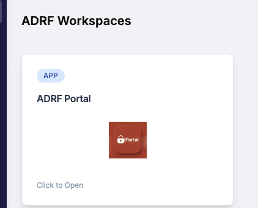

# 8. Export Reviewer Onboarding Guidance

Export reviews are conducted by individuals authorized by the data provider to perform a disclosure review. 

To perform an export review, you will need to have an active ADRF account. If you are a first time user, please see the following resources:

- If you are looking for instructions on how to log into the ADRF for the first time, see [Step-by-Step: How to Get into the ADRF for the first time](03-onboarding.md). 
- If you need to log into the ADRF, see [Logging into the ADRF](02-logging-in.md). 
- If you need help creating a secondary password, see [Establishing a Secondary Password for Your Project Workspace](04-work.md#establishing-a-secondary-password-for-your-project-workspace).

## Where to conduct an export review

If you are an authorized export reviewer, you will perform exports review in the ADRF Portal workspace tile.

Log into the ADRF Portal workspace to find documentation on performing an export review in these resources:

1. Video walkthrough: Find the files in the ADRF_Documentation folder on the G: drive.
2. Export review guidance: See the 'Export Reviews' section of the ADRF User Guide, available in Secure PASS upon login.

 

---
# Support

**Need help?**

- Email: support@coleridge.us

- Hours: Monday-Friday, 9 AM - 5 PM ET
